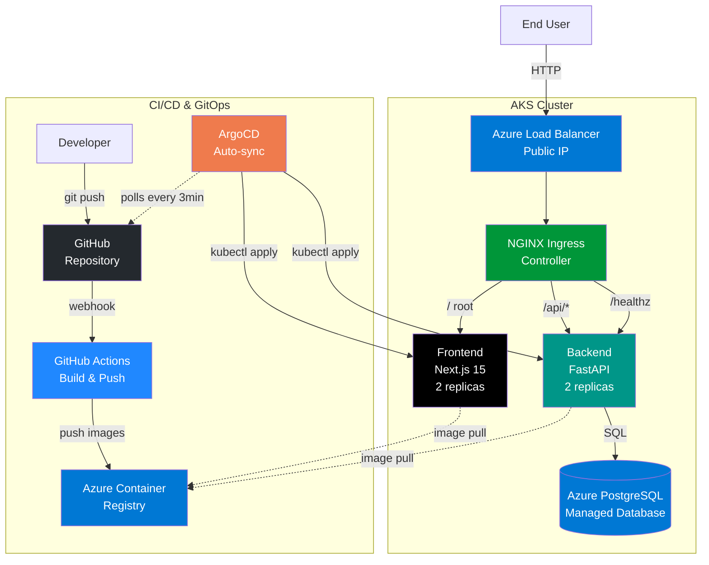

# Project Status & Development Guide

Complete overview of K8s Todo application deployment status and development workflow.

## 📚 Quick Navigation

| Document                                      | Purpose                                   |
| --------------------------------------------- | ----------------------------------------- |
| [Initial Setup](./initial-setup.md)           | First-time installation and configuration |
| [Daily Startup](./daily-startup.md)           | Quick commands to start working           |
| [Daily Cleanup](./daily-cleanup.md)           | End of day cleanup                        |
| [CI/CD Setup](./ci-cd-setup.md)               | GitHub Actions pipeline documentation     |
| [Frontend Dev Guide](./frontend-dev-guide.md) | Frontend development                      |

## 🎯 Quick Start

**Already set up?** → [Daily Startup Guide](./daily-startup.md)

**First time?** → [Initial Setup Guide](./initial-setup.md)

**Setup CI/CD?** → [CI/CD Setup Guide](./ci-cd-setup.md)

## 🏗️ Architecture

### Flow Diagram

```
Local Development (Docker Desktop K8s)
    ↓
Azure Infrastructure (Terraform)
    ├── Resource Group
    ├── Azure Container Registry (ACR)
    └── Azure Kubernetes Service (AKS)
    ↓
CI/CD (GitHub Actions)
    ├── Build Docker images
    ├── Push to ACR
    └── Trigger ArgoCD sync
    ↓
GitOps (ArgoCD)
    ├── Auto-sync from Git
    └── Deploy to AKS
    ↓
Networking (NGINX Ingress)
    ├── Azure Load Balancer (Public IP)
    └── HTTP traffic routing
    ↓
Application (Helm)
    ├── Backend (FastAPI + PostgreSQL)
    └── Frontend (Next.js)
```

### Mermaid Diagram

Copy this to [mermaid.live](https://mermaid.live) for visualization:



## 🔄 Workflow

### Development Workflow (Automated)

1. Make code changes locally
2. Test with Docker Desktop K8s
3. Commit and push to GitHub
4. **GitHub Actions automatically:**
   - Builds Docker images
   - Pushes to ACR
5. **ArgoCD automatically:**
   - Detects Git changes
   - Syncs Kubernetes resources
   - Deploys to AKS
6. Access app via Public IP or custom domain

### Manual Workflow (When Needed)

1. Develop and test locally with Docker Desktop
2. Build Docker images
3. Push images to ACR
4. ArgoCD syncs from Git

## Deployment Checklist

### Infrastructure Setup

- ✅ Docker Desktop with Kubernetes enabled
- ✅ Azure CLI installed and configured
- ✅ Terraform installed
- ✅ Helm installed
- ✅ kubectl configured

## Local Development

- ✅ Docker images build successfully
- ✅ Local Kubernetes cluster running
- ✅ Application deployed locally with Helm
- ✅ Port-forwarding working (frontend + backend)
- ✅ Database persistence working

## Azure Infrastructure

- ✅ Terraform configuration created
- ✅ Azure Resource Group deployed
- ✅ Azure Container Registry (ACR) created
- ✅ AKS cluster deployed (2x Standard_B2s nodes)
- ✅ AKS connected to ACR
- ✅ kubectl connected to AKS

## Container Images

- ✅ Backend image built locally
- ✅ Frontend image built locally
- ✅ Images pushed to ACR
- ✅ Image tags versioned

## Kubernetes Deployment

- ✅ Helm charts created
- ✅ Backend deployment configured
- ✅ Frontend deployment configured
- ✅ PostgreSQL deployment configured
- ✅ Services configured (ClusterIP)
- ✅ ConfigMaps for environment variables
- ✅ PersistentVolumeClaim for database
- ✅ Resource requests/limits defined
- ✅ Health checks (liveness/readiness) configured

## Application Running

- ✅ Application deployed to AKS
- ✅ All pods running (2 replicas each)
- ✅ Database initialized
- ✅ Backend API accessible
- ✅ Frontend accessible
- ✅ Backend ↔ Database connection working
- ✅ Frontend ↔ Backend communication working

## CI/CD Pipeline

- ✅ GitHub Actions workflow created
- ✅ Build job (Docker images)
- ✅ Push to ACR job
- ✅ Automatic deployment on push to main
- ✅ Version tagging strategy (Git SHA + latest)

## GitOps (ArgoCD)

- ✅ ArgoCD installed in AKS
- ✅ ArgoCD Application manifest created
- ✅ Git repository as source of truth (main branch)
- ✅ Auto-sync enabled (3 min polling)
- ✅ Self-heal enabled (reverts manual changes)
- ✅ Prune enabled (removes resources not in Git)

## Networking & Ingress

- ✅ NGINX Ingress Controller installed
- ✅ Azure Load Balancer created (Public IP assigned)
- ✅ Ingress rules configured (`/healthz`, `/health`, `/api`, `/`)
- ✅ CORS configured in Ingress
- ✅ Health probes working (Load Balancer gets 200 OK)
- ✅ Public URL accessible (HTTP only)

## Database

- ✅ Azure Database for PostgreSQL deployed
- ✅ Connection from AKS to Azure DB working
- ✅ Database backups configured (7 days retention)
- ✅ Migration from in-cluster Postgres complete (conditional deployment via Helm)

## Documentation

- ✅ Initial setup guide
- ✅ Daily startup guide
- ✅ Daily cleanup guide
- ✅ CI/CD pipeline documentation
- ✅ ArgoCD setup documented
- ✅ Ingress setup documented
- ✅ Ingress routing documented (`/healthz`, `/health`, `/api`, `/`)
- ✅ API documentation (/api/docs)
- ✅ Basic architecture diagram

## Testing

- ✅ Syntax linting (flake8 + ESLint)
- ✅ Code formatting (black + Prettier via ESLint)
- ✅ Type checking (TypeScript)

## 📊 Current Status

**Environment:** AKS (Azure Kubernetes Service)  
**Nodes:** 2x Standard_B2s (2 vCPU, 8GB RAM each)  
**Replicas:** 2x Backend, 2x Frontend  
**Database:** Azure Database for PostgreSQL (B_Standard_B1ms, 32GB storage)  
**CI/CD:** GitHub Actions (build images on push to main)  
**GitOps:** ArgoCD (auto-sync from main branch)  
**Ingress:** NGINX Ingress Controller with Azure Load Balancer  
**Security:** Development mode (HTTP only, secrets in Git - NOT production ready)  
**Cost:** ~$87/month (~$22 for Load Balancer + IP, ~$22 for PostgreSQL, use `terraform destroy` when not in use)

**Note:** Public IP changes on `terraform destroy/apply`.
